# GeneradorUML — Herramienta CASE Integral de Ingeniería de Software

[](https://fastapi.tiangolo.com)
[](https://spring.io/projects/spring-boot)
[](https://flutter.dev)
[](https://www.omg.org/spec/UML/)
[](https://www.omg.org/spec/XMI/)
[](https://developer.mozilla.org/es/docs/Web/Progressive_web_apps)
[](tests/)

**GeneradorUML** es una herramienta CASE (*Computer-Aided Software Engineering*) integral de nivel profesional que permite modelar, editar e interpretar diagramas de clases **UML 2.5+**, colaborar en tiempo real y transformar automáticamente los diagramas en un sistema de producción funcional de extremo a extremo:

1. **Backend REST:** Spring Boot 3.x con Java 17/21, Spring Data JPA / Hibernate, controladores REST, DTOs desacoplados y PostgreSQL.
2. **Frontend Móvil y Web:** Aplicación multiplataforma Flutter 3.x con Material 3, tema dinámico claro/oscuro, pantallas CRUD reactivas con validación, caché offline y pantalla de Asistente IA/Voz.
3. **Colaboración Multiusuario en Tiempo Real:** Edición simultánea estilo Google Docs vía WebSockets con algoritmo **Three-Way Merge** campo a campo, tokens de capacidad y base de datos de revisiones en SQLite.
4. **Motor de IA Local en el Navegador (Sin Costo de Tokens):** 
   - Transcripción y comandos por voz con **Whisper Tiny ONNX** en Web Worker.
   - OCR local de fotografías de pizarras o diagramas en papel con **Tesseract.js WASM**.
   - Procesamiento 100% en el dispositivo del usuario sin enviar datos a APIs externas.
5. **Modo Móvil Responsivo y PWA:** Interfaz optimizada para teléfonos con tarjetas táctiles de clases, parser de lenguaje natural y funcionamiento offline con Service Worker.
6. **Interoperabilidad Estándar:** Importación y exportación bidireccional XMI 2.1 (Enterprise Architect y StarUML) y StarUML `.mdj`.
7. **Colección Postman:** Postman Collection v2.1.0 con pruebas de aserción automatizadas para cada endpoint generado.

---

## 🚀 Inicio Rápido

### 1. Clonar el repositorio:
```bash
git clone <url-del-repositorio>
cd generador-uml
```

### 2. Instalar dependencias del backend:
```bash
cd backend
pip install -r requirements.txt
cd ..
```

### 3. Iniciar el servidor GeneradorUML:
```bash
python -m uvicorn app.main:app --host 0.0.0.0 --port 8000 --reload
```

### 4. Abrir en el navegador:
- **Editor Web Principal (Lienzo SVG de escritorio):** [http://localhost:8000](http://localhost:8000)
- **Editor Web Móvil (PWA táctil para smartphones):** [http://localhost:8000/?view=mobile](http://localhost:8000/?view=mobile)

---

## 🏗️ Arquitectura del Sistema

```mermaid
graph TB
    subgraph Cliente["Frontend (PWA / SPA)"]
        CANVAS["Lienzo Vectorial SVG (app.js)"]
        COLLAB_CLIENT["Cliente Colaborativo (collaboration.js)"]
        MOBILE_UI["Modo Móvil & Tarjetas (mobile.js)"]
        CMD_PARSER["Parser Comandos UML (uml-commands.js)"]
        AI_LOCAL["Motor IA Local (local-ai.js)"]
        WHISPER_WORKER["Whisper Tiny ONNX Worker (voice-worker.js)"]
        TESSERACT_OCR["Tesseract.js WASM (OCR)"]
        SW["Service Worker Offline (sw.js)"]
    end

    subgraph Backend_FastAPI["Servidor CASE (FastAPI)"]
        API_MAIN["FastAPI Core (main.py)"]
        COLLAB_SERVER["Servicio WebSocket & Merge (collaboration.py)"]
        REST_CONTRACT["Capa de Contratos REST (rest_contract.py)"]
        GEN_SB["Generador Spring Boot (springboot_generator.py)"]
        GEN_FL["Generador Flutter (flutter_generator.py)"]
        GEN_PM["Generador Postman (postman_generator.py)"]
        CV_PHOTO["Visión Artificial / OCR Servidor (photo_interpreter.py)"]
        ADAPT_XMI["Adaptador XMI 2.1 (xmi_adapter.py)"]
        ADAPT_MDJ["Adaptador StarUML (mdj_adapter.py)"]
    end

    subgraph Almacenamiento["Persistencia"]
        SQLITE["Salas y Revisiones (collaboration.sqlite3)"]
        PROJ_STORAGE["Proyectos Guardados (output/projects/*.json)"]
    end

    subgraph Salida_Generada["Código Generado de Producción"]
        OUT_SB["Spring Boot 3 + JPA + PostgreSQL"]
        OUT_FL["Flutter 3 App (Android Nativo / Web)"]
        OUT_PM["Colección Postman v2.1.0"]
    end

    CANVAS --> COLLAB_CLIENT
    MOBILE_UI --> CMD_PARSER
    MOBILE_UI --> AI_LOCAL
    AI_LOCAL --> WHISPER_WORKER
    AI_LOCAL --> TESSERACT_OCR
    COLLAB_CLIENT <-->|WebSocket Seguro| COLLAB_SERVER
    CANVAS -->|REST API| API_MAIN
    COLLAB_SERVER --> SQLITE
    API_MAIN --> PROJ_STORAGE
    API_MAIN --> GEN_SB
    API_MAIN --> GEN_FL
    API_MAIN --> GEN_PM
    GEN_SB --> OUT_SB
    GEN_FL --> OUT_FL
    GEN_PM --> OUT_PM
```



---

## 🌟 Módulos y Capacidades Destacadas

### 👥 1. Colaboración en Tiempo Real
- **Three-Way Merge:** Algoritmo de resolución campo a campo que combina concurrentemente clases, atributos, visibilidades y posiciones visuales.
- **Autorización por Capacidad:** Enlaces con roles diferenciados:
  - `admin`: Control total y generación de invitaciones.
  - `editor`: Edición colaborativa bidireccional.
  - `viewer`: Solo lectura con sincronización visual en tiempo real.
- **Historial de Revisiones:** Cada cambio exitoso genera un snapshot inmutable en SQLite.
- **Detección y Diálogo de Conflictos:** En caso de ediciones contradictorias irreconciliables, se abre una ventana modal que permite elegir la versión local, remota o cancelar.

### 🧠 2. IA Local y Modelado por Voz / Foto
- **Sin consumo de tokens ni conexión a la nube:** Los modelos corren completamente dentro del navegador.
- **Reconocimiento de Voz:** Modelo Whisper Tiny cuantizado (ONNX) ejecutado en un Web Worker para no congelar la interfaz gráfica.
- **Comandos en Español Natural:** Permite dictar instrucciones como:
  - *"Crea una clase Usuario con atributos id de tipo entero y nombre de tipo texto"*
  - *"Agrega atributo precio de tipo decimal a clase Producto"*
  - *"Elimina la clase Cliente"*
- **OCR de Pizarras (Human-in-the-Loop):** Reconoce clases y atributos manuscritos en fotografías, permitiendo al usuario revisar y ajustar el texto antes de volcarlo al lienzo.

### 📱 3. Modo Móvil Responsivo y PWA
- **Modo Adaptable:** Al ingresar desde un smartphone o redimensionar la ventana (`<= 760px`), la aplicación conmuta automáticamente al espacio de trabajo móvil.
- **PWA Instalable:** Dispone de `manifest.webmanifest` y Service Worker (`sw.js`) con estrategia network-first para el shell y cache-first para activos estáticos.
- **Precacheo Offline:** El botón *"Preparar voz y foto sin conexión"* descarga y cachea los pesos de IA y librerías WASM para modelar sin Internet.

### 📲 4. Aplicación Móvil Flutter Generada
- **Multiplataforma:** Compilable para **Android Nativo** (APK/AAB) y para la **Web** (`flutter run -d chrome`).
- **Material 3 & Tema Dinámico:** Paleta de colores armónica con cambio instantáneo entre modo claro y modo oscuro.
- **Asistente de Consultas y Voz:** Pantalla dedicada (`lib/screens/assistant_screen.dart`) que integra `speech_to_text` para búsquedas y consultas por voz.
- **Caché Local Offline:** Integración con `shared_preferences` para almacenar y consultar registros previamente cargados aún si el backend Spring Boot está apagado.
- **Configuración Dinámica:** Menú de ajustes (⚙️) para cambiar la URL del servidor REST sobre la marcha (útil para pruebas en red local Wi-Fi: `http://192.168.x.x:8080/api`).

---

## 📂 Estructura del Repositorio

```
generador-uml/
├── backend/
│   ├── app/
│   │   ├── main.py                      # FastAPI REST API, endpoints unificados y fotos
│   │   ├── models/
│   │   │   ├── uml_model.py             # Metamodelo UML 2.5+ interno
│   │   │   └── uml_validator.py         # Validador de reglas semánticas UML
│   │   └── services/
│   │       ├── collaboration.py         # WebSockets, Three-Way Merge, SQLite Store y Rate Limiting
│   │       ├── rest_contract.py         # DTOs tipados y contratos de API REST
│   │       ├── springboot_generator.py  # Generador Spring Boot 3 + JPA + PostgreSQL
│   │       ├── flutter_generator.py     # Generador Flutter 3.x + Material 3 + Asistente Voz
│   │       ├── postman_generator.py     # Generador Postman Collection v2.1.0
│   │       ├── xmi_adapter.py           # Adaptador bidireccional XMI 2.1 (ISO/IEC 19509)
│   │       ├── mdj_adapter.py           # Adaptador bidireccional StarUML .mdj
│   │       └── photo_interpreter.py     # Visión Artificial (OpenCV) y OCR
│   └── requirements.txt
├── frontend/
│   ├── index.html                       # Editor web SPA completo (Escritorio + Móvil)
│   ├── manifest.webmanifest             # Manifiesto PWA para instalación en Android/Desktop
│   ├── sw.js                            # Service Worker con caché offline
│   ├── assets/
│   │   ├── models/                      # Modelos locales Whisper Tiny ONNX
│   │   ├── vendor/                      # Tesseract.js WASM, Transformers.js y dependencias
│   │   └── offline-files.json           # Manifiesto de archivos precacheados para modo offline
│   ├── css/
│   │   ├── index.css                    # Sistema de diseño con glassmorphism y tema oscuro
│   │   └── mobile.css                   # Estilos dedicados para el espacio móvil responsivo
│   └── js/
│       ├── app.js                       # Lógica del lienzo SVG, renderizado y debounce
│       ├── collaboration.js             # Protocolo WebSocket, tokens y diálogo de conflictos
│       ├── local-ai.js                  # Orquestación de IA local (Voz + OCR)
│       ├── mobile.js                    # Espacio de trabajo móvil y gestión de tarjetas
│       ├── uml-commands.js              # Gramática y parser de comandos UML en español
│       └── voice-worker.js              # Web Worker para transcripción con Whisper
├── tests/
│   ├── conftest.py                      # Configuración automática de sys.path para pytest
│   ├── test_collaboration.py            # Pruebas de merge, WebSockets, permisos y SQLite
│   ├── test_generators.py               # Pruebas unitarias de generación de código e interoperabilidad
│   ├── test_api_extensions.py          # Pruebas de límites de fotos, rate limiting y persistencia unificada
│   └── test_uml_commands.cjs            # Pruebas del parser de comandos UML en JavaScript
├── examples/
│   ├── veterinaria.json                 # Caso de prueba (5 clases, relaciones completas)
│   └── cursos.json                      # Caso de prueba de sistema académico
├── docs/
│   ├── manual_usuario.md                # Manual de usuario paso a paso
│   └── arquitectura.md                  # Documento de arquitectura de software y patrones
└── output/                              # Proyectos y artefactos generados
```

---

## 🧪 Ejecución de Pruebas Automatizadas

El proyecto cuenta con una suite completa de pruebas unitarias y de integración que se ejecutan directamente con:

### 1. Pruebas del Backend (28 tests en Python):
```bash
pytest
```
*Salida esperada:*
```text
tests/test_api_extensions.py ....       [ 14%]
tests/test_collaboration.py ....        [ 28%]
tests/test_generators.py ................[ 100%]
====================== 28 passed in 2.60s ======================
```

### 2. Pruebas de Comandos UML (JavaScript / Node.js):
```bash
node tests/test_uml_commands.cjs
```
*Salida esperada:*
```text
Comandos UML: 6 verificaciones correctas
```

---

## 📱 Cómo Ejecutar la Aplicación Móvil Flutter Generada

Cuando generas el código desde el editor, la carpeta del proyecto Flutter se crea en `output/project_<id>/flutter_app`.

### Opción A: Probar en Google Chrome (Web)
```bash
cd output/project_<id>/flutter_app
flutter run -d chrome
```

### Opción B: Probar en un Teléfono Android Físico por Cable USB
1. En tu teléfono Android activa las **Opciones de desarrollador** y la **Depuración por USB**.
2. Conecta el teléfono a la PC mediante cable USB y acepta el permiso de depuración en la pantalla.
3. Verifica que tu teléfono sea detectado:
   ```bash
   flutter devices
   ```
4. Ejecuta la aplicación directamente hacia tu dispositivo:
   ```bash
   flutter run -d <id_del_dispositivo>
   ```

---

## ☕ Cómo Ejecutar el Backend Spring Boot Generado

```bash
cd output/project_<id>/springboot

# En Linux / Mac:
./mvnw spring-boot:run

# En Windows:
.\mvnw.cmd spring-boot:run
```
El servicio REST quedará disponible en: `http://localhost:8080/api/<entidad>`.

---

## 📖 Documentación Adicional

- [Manual de Usuario](docs/manual_usuario.md): Guía de modelado de clases, atajos de teclado, dictado por voz y exportación.
- [Documento de Arquitectura](docs/arquitectura.md): Patrones de diseño, metamodelo UML 2.5+, Three-Way Merge y pipeline de generación.

---
*GeneradorUML — Herramienta CASE de Ingeniería de Software.*
