# GeneradorUML — Herramienta CASE Integral de Ingeniería de Software

[](https://fastapi.tiangolo.com)
[](https://ai.google.dev/)
[](https://openai.com/research/whisper)
[](mobile-android/)
[](https://spring.io/projects/spring-boot)
[](https://flutter.dev)
[](https://www.omg.org/spec/UML/)
[](tests/)

**GeneradorUML** es una herramienta CASE (*Computer-Aided Software Engineering*) integral de nivel profesional que permite modelar, editar e interpretar diagramas de clases **UML 2.5+**, colaborar en tiempo real y transformar automáticamente los diagramas en un sistema de producción funcional de extremo a extremo:

1. **Asistente Conversacional Inteligente (Siri UML):** Diálogo natural en español con **Google Gemini Flash** y síntesis de voz (TTS). Permite crear, modificar clases, atributos y relaciones hablando con naturalidad con feedback visual en tiempo real (orbe reactivo y analizador de ondas WebAudio).
2. **Colaboración Multiusuario en Tiempo Real:** Edición simultánea estilo Google Docs vía WebSockets con algoritmo **Three-Way Merge** campo a campo, tokens de capacidad y base de datos de revisiones en SQLite.
3. **Aplicación Móvil Android Nativa:** App instalada (`mobile-android/`) optimizada para smartphones, con compatibilidad offline, conexión automática USB (`adb reverse`) o Wi-Fi local, y sincronización en tiempo real.
4. **Motor de IA Local en el Dispositivo (Sin Costo de Tokens):** 
   - Transcripción y comandos por voz con **Whisper Tiny ONNX** en Web Worker.
   - OCR de fotografías de pizarras o diagramas en papel con **Tesseract.js WASM**.
   - Filtro inteligente de silencios y ruidos (`[MÚSICA]`, etc.).
5. **Generación de Backend REST:** Spring Boot 3.x con Java 17/21, Spring Data JPA / Hibernate, controladores REST, DTOs desacoplados y PostgreSQL.
6. **Generación de Frontend Móvil y Web:** Aplicación multiplataforma Flutter 3.x con Material 3, tema dinámico claro/oscuro, pantallas CRUD reactivas con validación, caché offline y pantalla de Asistente IA/Voz.
7. **Interoperabilidad Estándar & Pruebas:** Importación y exportación bidireccional XMI 2.1 (Enterprise Architect y StarUML), StarUML `.mdj` y colección Postman v2.1.0 automatizada.

---

## 🚀 Inicio Rápido

### 1. Clonar el repositorio:
```bash
git clone <url-del-repositorio>
cd generador-uml
```

### 2. Instalar dependencias del backend:
```bash
cd backend
pip install -r requirements.txt
cd ..
```

### 3. Configurar API Key de Gemini:
Crea un archivo `.env` en `backend/.env` (o en la raíz del proyecto):
```env
GEMINI_API_KEY="tu_clave_de_gemini_aqui"
```

### 4. Iniciar el servidor GeneradorUML:
```bash
python -m uvicorn backend.app.main:app --host 0.0.0.0 --port 8000 --reload
```

### 5. Abrir en el navegador o dispositivo:
- **Editor Web Principal (Lienzo interactivo de escritorio):** [http://localhost:8000](http://localhost:8000)
- **Editor Web Móvil (PWA táctil para smartphones):** [http://localhost:8000/?view=mobile](http://localhost:8000/?view=mobile)
- **App Android Nativa:** Compilar e instalar con `powershell.exe -ExecutionPolicy Bypass -File .\scripts\Build-Mobile.ps1 -Install`

---

## 🏗️ Arquitectura del Sistema

```mermaid
graph TB
    subgraph Cliente["Frontend (PWA / SPA)"]
        CANVAS["Lienzo Vectorial SVG (app.js)"]
        COLLAB_CLIENT["Cliente Colaborativo (collaboration.js)"]
        MOBILE_UI["Modo Móvil & Tarjetas (mobile.js)"]
        CMD_PARSER["Parser Comandos UML (uml-commands.js)"]
        AI_LOCAL["Motor IA Local (local-ai.js)"]
        WHISPER_WORKER["Whisper Tiny ONNX Worker (voice-worker.js)"]
        TESSERACT_OCR["Tesseract.js WASM (OCR)"]
        SW["Service Worker Offline (sw.js)"]
    end

    subgraph Backend_FastAPI["Servidor CASE (FastAPI)"]
        API_MAIN["FastAPI Core (main.py)"]
        COLLAB_SERVER["Servicio WebSocket & Merge (collaboration.py)"]
        REST_CONTRACT["Capa de Contratos REST (rest_contract.py)"]
        GEN_SB["Generador Spring Boot (springboot_generator.py)"]
        GEN_FL["Generador Flutter (flutter_generator.py)"]
        GEN_PM["Generador Postman (postman_generator.py)"]
        CV_PHOTO["Visión Artificial / OCR Servidor (photo_interpreter.py)"]
        ADAPT_XMI["Adaptador XMI 2.1 (xmi_adapter.py)"]
        ADAPT_MDJ["Adaptador StarUML (mdj_adapter.py)"]
    end

    subgraph Almacenamiento["Persistencia"]
        SQLITE["Salas y Revisiones (collaboration.sqlite3)"]
        PROJ_STORAGE["Proyectos Guardados (output/projects/*.json)"]
    end

    subgraph Salida_Generada["Código Generado de Producción"]
        OUT_SB["Spring Boot 3 + JPA + PostgreSQL"]
        OUT_FL["Flutter 3 App (Android Nativo / Web)"]
        OUT_PM["Colección Postman v2.1.0"]
    end

    CANVAS --> COLLAB_CLIENT
    MOBILE_UI --> CMD_PARSER
    MOBILE_UI --> AI_LOCAL
    AI_LOCAL --> WHISPER_WORKER
    AI_LOCAL --> TESSERACT_OCR
    COLLAB_CLIENT <-->|WebSocket Seguro| COLLAB_SERVER
    CANVAS -->|REST API| API_MAIN
    COLLAB_SERVER --> SQLITE
    API_MAIN --> PROJ_STORAGE
    API_MAIN --> GEN_SB
    API_MAIN --> GEN_FL
    API_MAIN --> GEN_PM
    GEN_SB --> OUT_SB
    GEN_FL --> OUT_FL
    GEN_PM --> OUT_PM
```



---

## 🌟 Módulos y Capacidades Destacadas

### 🎙️ 1. Siri UML — Asistente de Voz Conversacional (Gemini Flash)
- **Comprensión de Lenguaje Natural en Español:** Permite dialogar de forma libre con el asistente (ej. *"Crea la clase Factura con número de tipo int y total de tipo double"* o *"Añade una relación de agregación entre Empresa y Empleado"*).
- **Razonamiento con Google Gemini Flash:** El modelo de lenguaje interpreta la semántica, deduce tipos de datos estándar (String, Integer, Double, LocalDate, etc.) y aplica modificaciones directas sobre el metamodelo UML.
- **Voz Bidireccional (Speech-to-Speech):**
  - Captura y transcripción ágil en el dispositivo con **Whisper IA**.
  - Respuesta hablada natural mediante **Web SpeechSynthesis (TTS)**.
- **Orbe Reactivo y Visualizador WebAudio:**
  - Orbe interactivo con transiciones de estado: *Reposo* (violeta), *Preparación* (ámbar), *Grabando* (rojo carmesí pulsante con ondas radar y botón de stop ⏹) y *Razonando* (cian giratorio).
  - Analizador de frecuencia de audio en tiempo real (`AudioContext` / `AnalyserNode`): las barras de sonido y el orbe reaccionan físicamente a los cambios de tono y volumen de tu voz.
- **Filtro de Silencios:** Descarta automáticamente artefactos de audio o ruidos ambientales (`[MÚSICA]`, etc.) sin enviar solicitudes espurias al modelo.

### 👥 2. Colaboración en Tiempo Real (Estilo Google Docs)
- **Three-Way Merge:** Algoritmo de resolución campo a campo que combina concurrentemente clases, atributos, visibilidades y posiciones visuales.
- **Autorización por Capacidad:** Enlaces con roles diferenciados (`admin`, `editor`, `viewer`).
- **Historial de Revisiones:** Cada cambio exitoso genera un snapshot inmutable en SQLite.
- **Detección y Diálogo de Conflictos:** Modal visual para resolver diferencias en caso de ediciones simultáneas incompatibles.

### 📱 3. Aplicación Móvil Android Nativa (`mobile-android/`)
- **Wrapper Nativo de Alto Rendimiento:** Aplicación Android completa en Java con `WebViewAssetLoader` y aceleración por hardware.
- **Conectividad Híbrida Inteligente:**
  - Cable USB vía túnel reverso (`adb reverse tcp:8000 tcp:8000`).
  - Red local Wi-Fi automática (`http://192.168.x.x:8000`).
  - Estado sincronizado en tiempo real vía WebSockets entre la computadora y el teléfono.
- **Compilación e Instalación Automatizada:** Script PowerShell `Build-Mobile.ps1 -Install` que compila el APK y lo despliega directamente en el dispositivo físico conectado.

### 🧠 4. IA Local de Respaldo y OCR (Sin Nube)
- **Sin consumo de tokens ni conexión a la nube:** Motor de respaldo offline con Whisper Tiny ONNX en Web Worker.
- **OCR de Pizarras (Human-in-the-Loop):** Convierte fotografías de pizarras y papel en clases UML mediante visión artificial y Tesseract.js.

### 📲 5. Aplicación Móvil Flutter Generada
- **Multiplataforma:** Compilable para **Android Nativo** (APK/AAB) y para la **Web** (`flutter run -d chrome`).
- **Material 3 & Tema Dinámico:** Paleta de colores armónica con cambio instantáneo entre modo claro y modo oscuro.
- **Asistente de Consultas y Voz:** Pantalla dedicada (`lib/screens/assistant_screen.dart`) que integra `speech_to_text` para búsquedas y consultas por voz.
- **Caché Local Offline:** Integración con `shared_preferences` para almacenar y consultar registros previamente cargados aún si el backend Spring Boot está apagado.
- **Configuración Dinámica:** Menú de ajustes (⚙️) para cambiar la URL del servidor REST sobre la marcha.

---

## 📂 Estructura del Repositorio

```
generador-uml/
├── backend/
│   ├── app/
│   │   ├── main.py                      # FastAPI REST API, endpoints /api/assistant/converse y /api/health
│   │   ├── models/
│   │   │   ├── uml_model.py             # Metamodelo UML 2.5+ interno
│   │   │   └── uml_validator.py         # Validador de reglas semánticas UML
│   │   └── services/
│   │       ├── gemini_assistant.py      # Servicio de NLP y razonamiento con Gemini Flash
│   │       ├── collaboration.py         # WebSockets, Three-Way Merge, SQLite Store y Rate Limiting
│   │       ├── rest_contract.py         # DTOs tipados y contratos de API REST
│   │       ├── springboot_generator.py  # Generador Spring Boot 3 + JPA + PostgreSQL
│   │       ├── flutter_generator.py     # Generador Flutter 3.x + Material 3 + Asistente Voz
│   │       ├── postman_generator.py     # Generador Postman Collection v2.1.0
│   │       ├── xmi_adapter.py           # Adaptador bidireccional XMI 2.1 (ISO/IEC 19509)
│   │       ├── mdj_adapter.py           # Adaptador bidireccional StarUML .mdj
│   │       └── photo_interpreter.py     # Visión Artificial (OpenCV) y OCR
│   ├── .env                             # Clave GEMINI_API_KEY
│   └── requirements.txt
├── frontend/
│   ├── index.html                       # Editor web SPA completo (Escritorio + Móvil + Siri Orb)
│   ├── manifest.webmanifest             # Manifiesto PWA para instalación en Android/Desktop
│   ├── sw.js                            # Service Worker con caché offline
│   ├── assets/                          # Pesos de IA, modelos Whisper Tiny ONNX y librerías WASM
│   ├── css/
│   │   ├── index.css                    # Sistema de diseño con glassmorphism y tema oscuro
│   │   └── mobile.css                   # Estilos responsivos, orbe reactivo y animaciones radar
│   └── js/
│       ├── app.js                       # Lógica del lienzo, renderizado y debounce
│       ├── collaboration.js             # Protocolo WebSocket, tokens y diálogo de conflictos
│       ├── conversational-assistant.js  # Motor Siri UML, integración Gemini Flash y WebAudio
│       ├── local-ai.js                  # Orquestación de IA local (Voz + OCR)
│       ├── mobile.js                    # Espacio de trabajo móvil y gestión de tarjetas
│       ├── uml-commands.js              # Gramática y parser de comandos UML en español
│       └── voice-worker.js              # Web Worker para transcripción con Whisper
├── mobile-android/                      # Aplicación Android nativa (Java + WebView wrapper)
│   ├── app/src/main/                    # Código nativo Android y assets
│   ├── build.gradle
│   └── gradlew.bat
├── scripts/
│   └── Build-Mobile.ps1                 # Script de compilación y despliegue por USB en Android
├── tests/
│   ├── conftest.py                      # Configuración automática de sys.path para pytest
│   ├── test_collaboration.py            # Pruebas de merge, WebSockets, permisos y SQLite
│   ├── test_generators.py               # Pruebas unitarias de generación de código e interoperabilidad
│   ├── test_api_extensions.py          # Pruebas de fotos, rate limiting y persistencia
│   └── test_uml_commands.cjs            # Pruebas del parser de comandos UML
├── examples/                            # Ejemplos de diagramas (veterinaria, cursos)
├── docs/                                # Manual de usuario y arquitectura
└── output/                              # Proyectos y artefactos generados (Spring Boot / Flutter)
```

---

## 🧪 Ejecución de Pruebas Automatizadas

El proyecto cuenta con una suite completa de pruebas unitarias y de integración que se ejecutan directamente con:

### 1. Pruebas del Backend (28 tests en Python):
```bash
pytest
```
*Salida esperada:*
```text
tests/test_api_extensions.py ....       [ 14%]
tests/test_collaboration.py ....        [ 28%]
tests/test_generators.py ................[ 100%]
====================== 28 passed in 2.60s ======================
```

### 2. Pruebas de Comandos UML (JavaScript / Node.js):
```bash
node tests/test_uml_commands.cjs
```
*Salida esperada:*
```text
Comandos UML: 6 verificaciones correctas
```

---

## 📱 Cómo Compilar e Instalar la App Móvil Android (Graficador & Siri UML)

El proyecto incluye la aplicación móvil Android en `mobile-android/` para crear y modificar diagramas en tu teléfono con el Asistente Siri UML, dictado por voz y escáner de fotos.

### Instalación Directa por USB:
1. Conecta tu teléfono Android a la PC con depuración por USB habilitada.
2. Ejecuta el script de compilación e instalación automática:
   ```powershell
   powershell.exe -ExecutionPolicy Bypass -File .\scripts\Build-Mobile.ps1 -Install
   ```
3. Activa el túnel inverso para conectar el teléfono con el backend local del PC:
   ```bash
   adb reverse tcp:8000 tcp:8000
   ```
4. Abre la app **Graficador UML** en tu teléfono. El indicador superior mostrará `Sincronizado` y podrás usar el Asistente Siri UML por voz y en tiempo real.

---

## 📲 Cómo Ejecutar la Aplicación Móvil Flutter Generada

Cuando generas el código desde el editor, la carpeta del proyecto Flutter se crea en `output/project_<id>/flutter_app`.

### Opción A: Probar en Google Chrome (Web)
```bash
cd output/project_<id>/flutter_app
flutter run -d chrome
```

### Opción B: Probar en un Teléfono Android Físico por Cable USB
1. En tu teléfono Android activa las **Opciones de desarrollador** y la **Depuración por USB**.
2. Conecta el teléfono a la PC mediante cable USB y acepta el permiso de depuración en la pantalla.
3. Verifica que tu teléfono sea detectado:
   ```bash
   flutter devices
   ```
4. Ejecuta la aplicación directamente hacia tu dispositivo:
   ```bash
   flutter run -d <id_del_dispositivo>
   ```

---

## ☕ Cómo Ejecutar el Backend Spring Boot Generado

```bash
cd output/project_<id>/springboot

# En Linux / Mac:
./mvnw spring-boot:run

# En Windows:
.\mvnw.cmd spring-boot:run
```
El servicio REST quedará disponible en: `http://localhost:8080/api/<entidad>`.

---

## 📖 Documentación Adicional

- [Manual de Usuario](docs/manual_usuario.md): Guía de modelado de clases, atajos de teclado, dictado por voz y exportación.
- [Documento de Arquitectura](docs/arquitectura.md): Patrones de diseño, metamodelo UML 2.5+, Three-Way Merge y pipeline de generación.

## ✅ Evidencia de Validación (20 septiembre 2026)

### Tests Automatizados — 67/67 Python + 9 Node.js

| Suite | Tests | Estado |
|-------|------:|--------|
| `test_generators.py` — Spring Boot + Flutter + Validador UML + XMI/MDJ | 20 | ✅ |
| `test_collaboration.py` — Merge 3-way, permisos, reconexión | 5 | ✅ |
| `test_api_extensions.py` — Rate limiting, foto reject, proyectos | 4 | ✅ |
| `test_full_generation.py` — Proyecto completo SB + Flutter + Postman | 13 | ✅ |
| `test_photo_relationships.py` — Clasificación de flechas/rombos/líneas | 9 | ✅ |
| `test_interop_roundtrip.py` — Roundtrip XMI + MDJ doble + Enterprise Architect | 10 | ✅ |
| `test_interop_samples.py` — Archivos reales veterinaria | 2 | ✅ |
| `test_mdj_import.py` — Forward reference, vistas | 1 | ✅ |
| `test_xmi_roundtrip.py` — Herencia, relación antes de clases, paquetes | 3 | ✅ |
| **Node.js:** UML commands, assistant, mobile, photo, offline, backend | 9 suites | ✅ |

### Verificación en Navegador
- **Desktop** (`http://localhost:8000`): Canvas SVG, creación de clases, relaciones, propiedades — 0 errores JS
- **Móvil** (`http://localhost:8000/?view=mobile`): Asistente Siri UML, panel de voz — 0 errores JS

### Funcionalidades Validadas
- ✅ Editor visual SVG (drag & drop, zoom, relaciones 6 tipos)
- ✅ Validación UML 2.5+ (herencia circular, nombres duplicados)
- ✅ Generación Spring Boot 3.x (JPA, `mappedBy`, `@JsonManagedReference`)
- ✅ Generación Flutter 3.x (modelos, CRUD, offline con `SharedPreferences`)
- ✅ Generación colección Postman v2.1.0
- ✅ Colaboración WebSocket (three-way merge, permisos, reconexión)
- ✅ Import/Export XMI 2.1 + MDJ (StarUML) con roundtrip preservado
- ✅ Interpretación de fotos: detección de cajas, OCR, clasificación de relaciones (herencia/composición/agregación)
- ✅ Asistente conversacional con Gemini Flash + fallback local
- ✅ Motor de voz Whisper Tiny ONNX + Tesseract WASM (offline)

---
*GeneradorUML — Herramienta CASE de Ingeniería de Software.*
