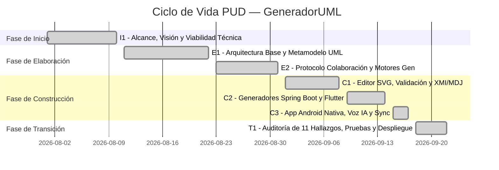
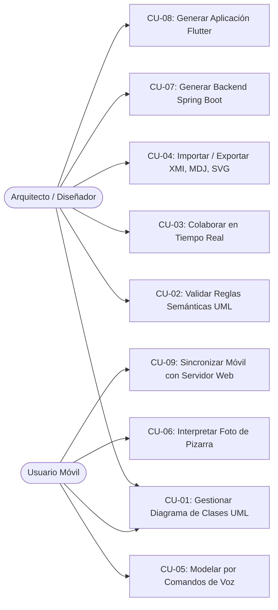

# Documento Metodológico: Proceso Unificado de Desarrollo (PUD) — GeneradorUML

**Proyecto:** GeneradorUML — Herramienta CASE de Ingeniería de Software  
**Metodología:** Proceso Unificado de Desarrollo (PUD / UP)  
**Fecha de Entrega / Defensa:** Septiembre 2026  
**Versión:** 1.0 Final  

---

## 1. Estructura de Fases y Ciclos (Iteraciones) del PUD

El desarrollo de **GeneradorUML** se organizó según el ciclo de vida iterativo e incremental del Proceso Unificado, cubriendo las 4 fases fundamentales:

### 1.1. Fase de Inicio (Inception — Iteración I1)
- **Objetivo:** Definir el alcance del sistema, identificar actores clave, establecer los casos de uso críticos y evaluar la factibilidad tecnológica.
- **Artefactos clave:** Documento de Visión, Modelo de Casos de Uso preliminar, selección del stack (FastAPI en backend, SVG/HTML5 vanilla en web, Android nativo/WebView con aceleración de hardware para móvil).

### 1.2. Fase de Elaboración (Elaboration — Iteraciones E1 y E2)
- **Objetivo:** Establecer la línea base de la arquitectura (4+1 vistas) y mitigar los principales riesgos técnicos.
- **Riesgos mitigados:**
  - *Riesgo 1:* Desempeño gráfico de renderizado -> Resuelto con arquitectura vectorial SVG pura a 60 FPS sin sobrecarga de frameworks pesados.
  - *Riesgo 2:* Concurrencia en colaboración en tiempo real -> Resuelto con protocolo WebSocket y resolución de conflictos por atributos a nivel de campo.
  - *Riesgo 3:* Consistencia en generación de código relacional -> Diseño del metamodelo unificado que mapea clases UML a entidades JPA y DTOs de Flutter.

### 1.3. Fase de Construcción (Construction — Iteraciones C1, C2 y C3)
- **C1 (Modelado & Interoperabilidad):** Implementación del editor visual, panel de propiedades, validador semántico UML 2.5+, y adaptadores XMI 2.1 y StarUML MDJ.
- **C2 (Generación de Código):** Motores de transformación hacia Spring Boot 3 (PostgreSQL, repositorios, controladores REST, validaciones) y Flutter 3 (modelos, servicios API, pantallas CRUD, tema Material 3).
- **C3 (Módulo Móvil y Asistencia Inteligente):** Empaquetado APK Android, integración de modelos offline (Whisper ONNX para transcripción de voz local, Tesseract para OCR de pizarras), y asistente de comandos por voz Siri UML.

### 1.4. Fase de Transición (Transition — Iteración T1)
- **Objetivo:** Asegurar la calidad, corregir defectos detectados en auditoría técnica (los 11 hallazgos: corrección de `mappedBy` JPA, referencias circulares Jackson, sincronización de rutas kebab-case, persistencia offline con `SharedPreferences`, exportación nativa en Android) y validar en hardware real conectado por USB.

---

## 2. Actores del Sistema

| Actor | Tipo | Descripción |
|-------|------|-------------|
| **Arquitecto / Diseñador de Software** | Humano (Web) | Crea y refina diagramas UML visualmente, ejecuta validaciones semánticas, exporta modelos (XMI/MDJ) y genera el código fuente (Spring Boot / Flutter). |
| **Colaborador** | Humano (Web) | Se une a una sesión de modelado mediante enlace compartido con roles asignados (Admin, Editor o Visualizador). |
| **Ingeniero en Campo / Usuario Móvil** | Humano (Android) | Utiliza la app móvil instalada para capturar bocetos de pizarra por foto, dictar comandos por voz o crear diagramas táctiles sin conexión a internet. |
| **Servidor GeneradorUML** | Sistema (Backend) | Gestiona salas WebSocket, valida diagramas, orquesta la transformación M2T (Model-to-Text) y sincroniza datos. |

---

## 3. Catálogo de Casos de Uso (CU)

### Especificación Resumida de Casos de Uso

#### **CU-01: Gestionar Diagrama de Clases UML**
- **Descripción:** Permite crear, editar, posicionar y eliminar clases, atributos (con tipo y visibilidad `+`, `-`, `#`), operaciones/métodos y relaciones (asociación, agregación, composición, generalización/herencia y dependencia) con multiplicidad.
- **Disponible en:** Web (lienzo visual) y Móvil (interfaz táctil y formularios).

#### **CU-02: Validar Reglas Semánticas UML (UML 2.5+)**
- **Descripción:** Analiza la estructura del modelo en busca de incoherencias (ciclos de herencia directa o transitiva, nombres de clase duplicados, atributos sin tipo, relaciones huérfanas).
- **Resultado:** Notificación visual de éxito o lista de advertencias/errores con severidad.

#### **CU-03: Colaborar en Tiempo Real con Control de Roles**
- **Descripción:** Permite a múltiples usuarios trabajar sobre el mismo proyecto simultáneamente a través de WebSockets. El anfitrión genera enlaces con permisos específicos:
  - `admin`: Edición total y gestión del proyecto.
  - `editor`: Creación y modificación de elementos del diagrama.
  - `viewer`: Solo lectura en tiempo real sin capacidad de modificar.

#### **CU-04: Importar y Exportar Modelos (Interoperabilidad CASE)**
- **Descripción:** Intercambio de diagramas con herramientas del mercado:
  - Formato JSON nativo (persistencia completa).
  - XMI 2.1 (compatibilidad bidireccional con Enterprise Architect).
  - StarUML `.mdj` (compatibilidad bidireccional con preservación de vistas y diagramas).
  - SVG vectorial (exportación de alta definición para reportes).

#### **CU-05: Modelado Asistido por Voz (Siri UML)**
- **Descripción:** Interpretación de comandos en lenguaje natural dictados por voz o texto (ejemplo: *"crear clase Curso con atributos id, titulo y duracion"*).
- **Mecanismo:** Procesamiento local con fallback inteligente a modelo LLM (Gemini Flash). En el móvil opera sin conexión gracias al modelo Whisper ONNX integrado.

#### **CU-06: Reconocimiento de Diagrama desde Foto / Pizarra**
- **Descripción:** Toma una fotografía o carga una imagen de un diagrama dibujado en pizarra o papel, procesa los contornos de cajas de clase y texto OCR, e inserta las clases detectadas en el modelo editable.

#### **CU-07: Generar Backend Completo (Spring Boot 3 + JPA + PostgreSQL)**
- **Descripción:** Transforma el diagrama de clases en un proyecto Maven completo y compilable:
  - Entidades JPA con anotaciones de relación (`@OneToMany`, `@ManyToOne(mappedBy=...)`).
  - Anotaciones Jackson (`@JsonManagedReference`, `@JsonBackReference`) para prevenir referencias circulares.
  - Repositorios Spring Data JPA, Servicios de negocio y Controladores REST (`kebab-case`).
  - Script SQL de base de datos y colección Postman exportable.

#### **CU-08: Generar Aplicación Cliente (Flutter CRUD)**
- **Descripción:** Genera una aplicación móvil/web en Flutter con:
  - Modelos Dart tipados y null-safe.
  - Servicios de consumo API sincronizados con el backend Spring Boot.
  - Pantallas de listado con búsqueda, pantalla de detalle, y formularios con validación.
  - Persistencia y caché offline en `SharedPreferences`.
  - Asistente de voz local integrado (`speech_to_text`).

#### **CU-09: Sincronización Bidireccional Offline/Online (Móvil <-> Web)**
- **Descripción:** El usuario móvil puede crear y ajustar diagramas sin conectividad (almacenamiento local en el dispositivo). Al recuperar la conexión o conectarse vía USB/red al backend, sincroniza automáticamente el diagrama con el servidor web.

---

## 4. Matriz de Trazabilidad y Casos de Prueba (PUD)

| ID Prueba | Caso de Uso Vinculado | Descripción del Caso de Prueba | Resultado Esperado | Estado |
|-----------|-----------------------|--------------------------------|--------------------|--------|
| **CP-01** | CU-01 | Crear clase `Persona`, agregar atributo `nombre: String`, método `obtenerDatos()` | La clase se dibuja en canvas y actualiza el panel | ✅ Aprobado |
| **CP-02** | CU-01 / CU-02 | Crear dos clases y relacionarlas con herencia cíclica (`A -> B -> A`) | El validador UML marca error crítico de ciclo | ✅ Aprobado |
| **CP-03** | CU-03 | Abrir enlace con rol `viewer` en pestaña privada | Canvas interactivo pero controles de edición deshabilitados | ✅ Aprobado |
| **CP-04** | CU-04 | Exportar a XMI 2.1 e importar nuevamente el archivo | Clases, atributos, tipos y relaciones preservadas | ✅ Aprobado |
| **CP-05** | CU-04 | Importar diagrama de StarUML `.mdj` con vistas | Importación exitosa con posiciones de coordenadas | ✅ Aprobado |
| **CP-06** | CU-05 | Dictar por voz: *"agregar clase Estudiante con atributos matricula y promedio"* | El asistente propone la acción y crea la clase | ✅ Aprobado |
| **CP-07** | CU-07 | Generar Spring Boot desde diagrama con relación 1:N | Genera `@JsonManagedReference` y `mappedBy` exacto | ✅ Aprobado |
| **CP-08** | CU-08 | Generar Flutter y verificar endpoints REST | Rutas kebab-case coinciden con Spring Boot | ✅ Aprobado |
| **CP-09** | CU-09 | Crear clase en la APK Android por formulario y verificar persistencia | Se guarda en almacenamiento local del dispositivo | ✅ Aprobado |
| **CP-10** | CU-09 | Conectar APK con backend `http://127.0.0.1:8000` (adb reverse) | El servidor recibe el estado del proyecto correctamente | ✅ Aprobado |
